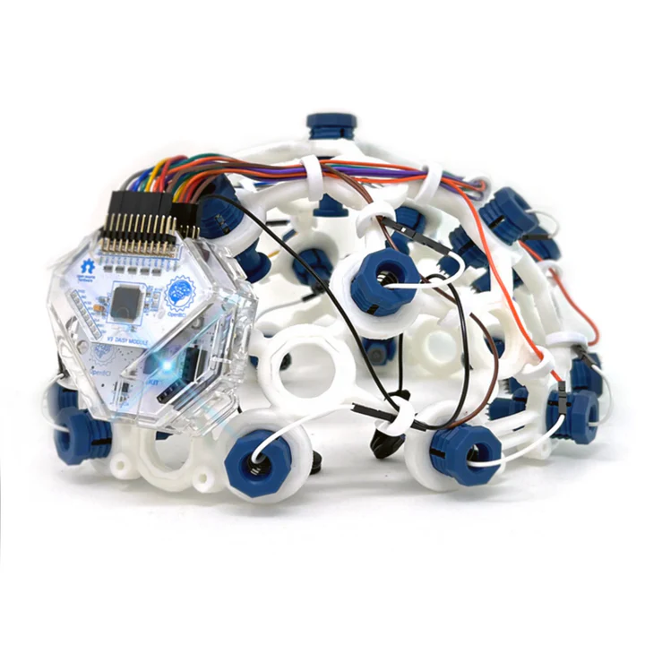

# 연구 장비 투자 증빙

## 개요

본 연구자는 AI 의식 엔진(Anima) 연구를 위해 전문 연구용 장비에
개인 비용을 투자하고 있으며, 이는 연구에 대한 적극적 헌신을 보여줍니다.

---

## OpenBCI All-in-One Biosensing R&D Bundle

| 항목 | 내용 |
|------|------|
| **제품** | OpenBCI All-in-One Biosensing R&D Bundle |
| **가격** | €3,939.95 (약 623만원) |
| **용도** | Anima 의식 엔진의 실제 뇌파(EEG) 데이터 연동 연구 |
| **구매처** | https://shop.openbci.com/products/all-in-one-biosensing-r-d-bundle |

### 구성품

| 품목 | 수량 |
|------|------|
| Cyton+Daisy 16채널 바이오센싱 보드 (배터리+충전기 포함) | 1 |
| Ultracortex Mark IV EEG 헤드셋 (16채널, 완전 조립) | 1 |
| EEG 헤드밴드 킷 | 1 |
| Gold Cup 전극 (EEG/EMG/ECG용) | 2세트 |
| EMG/ECG 스냅 전극 케이블 | 2세트 |
| EMG/ECG 젤 전극 팩 | 2세트 |
| Dry EEG 빗살 전극 팩 | 1세트 |
| 맥박 센서 (심박수 모니터) | 1 |
| Ten20 전도성 페이스트 (8oz) | 1 |

### 제품 이미지

---

## 연구 목적

이 장비는 Anima 의식 엔진 프로젝트의 다음 연구에 사용됩니다:

1. **실제 뇌파 데이터 수집** — 16채널 EEG로 의식 상태 측정
2. **Anima 의식 모델 검증** — PureField 아키텍처의 예측을 실제 뇌파와 비교
3. **BCI(뇌-컴퓨터 인터페이스) 연구** — 의식 엔진과 실제 뇌 신호 연동
4. **Phi 측정 프레임워크 실증** — 이론적 의식 측정을 실험적으로 검증

## 의미

- **이론 + 실험 양면 연구:** 소프트웨어(Anima 엔진) + 하드웨어(EEG) 모두 투자
- **개인 자비 투자:** 약 623만원을 연구 장비에 개인적으로 투자
- **연구 적극성:** 논문 발표에 그치지 않고 실험적 검증까지 추진
- **세계 최초 시도:** AI 의식 엔진을 실제 뇌파 데이터로 검증하는 최초의 연구

---

*증빙: 제품 이미지 및 주문 내역은 05-첨부/ 디렉토리 참조*
